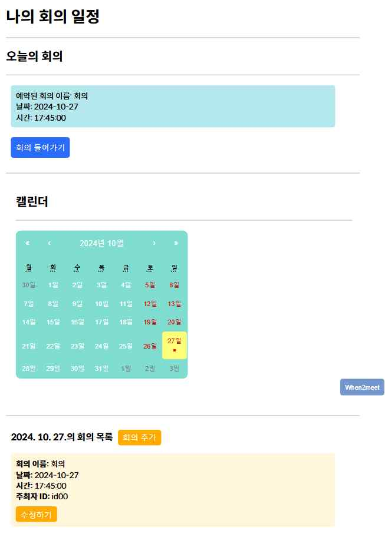
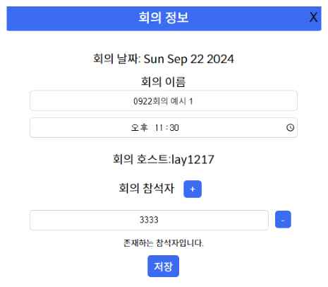
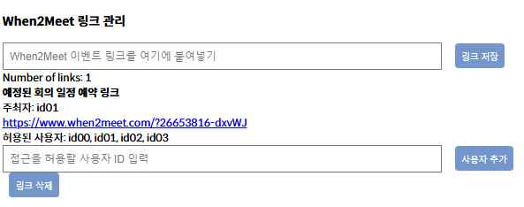
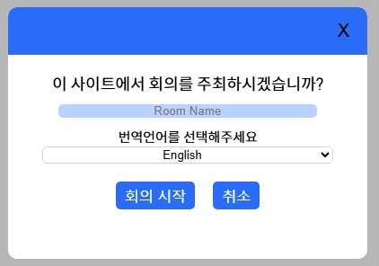
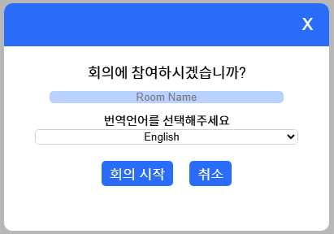
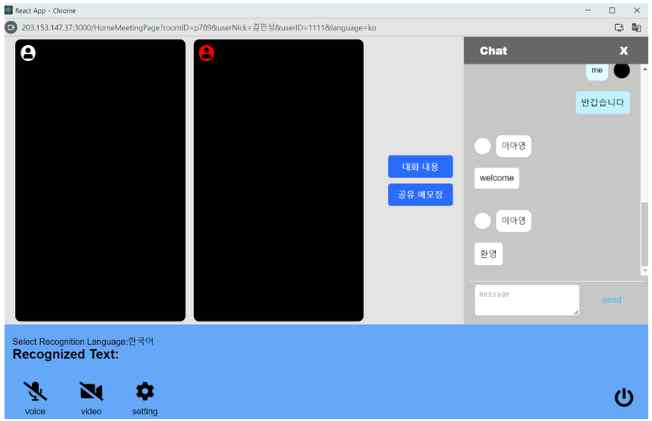
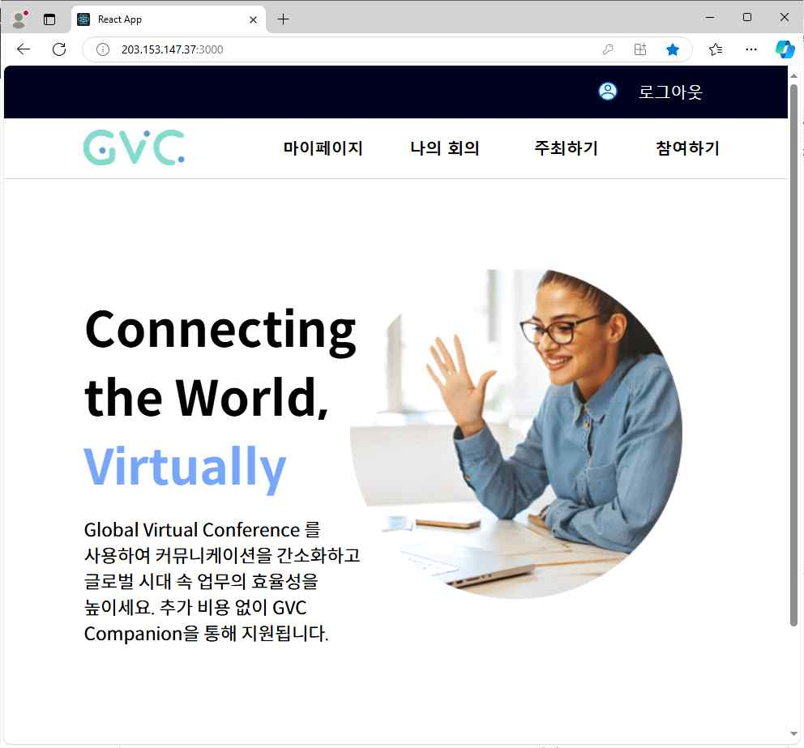
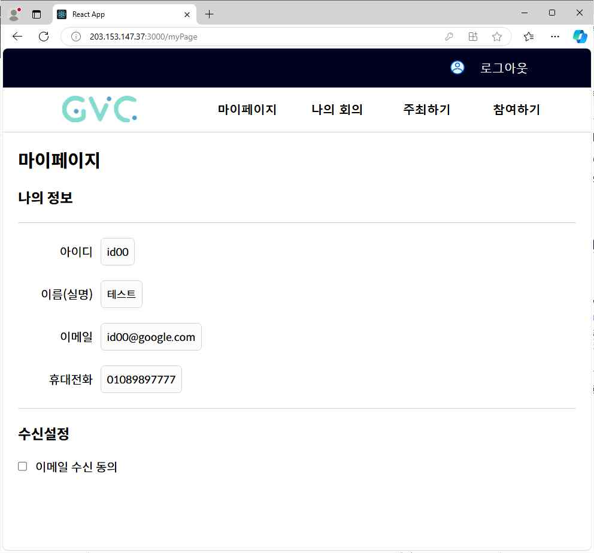

<div align="center">
  

  # GVC — Global Virtual Conference

  **언어와 국경을 넘어 소통하는 글로벌 화상회의 서비스**

  *2024 숙명여자대학교 ICT융합공학부 IT공학전공 졸업프로젝트*

  
  
  
  
  
</div>

---

## 프로젝트 소개

GVC(Global Virtual Conference)는 전 세계 사람들이 **언어·국적에 관계없이** 비즈니스 미팅을 원활하게 진행할 수 있도록 설계된 글로벌 화상회의 웹 서비스입니다.

기존 화상회의 플랫폼의 한계를 보완하여 다음 문제를 해결합니다.

| 기존 문제 | GVC 해결책 |
|-----------|-----------|
| 시간대 조율이 어려움 | when2meet 연동 회의 일정 조율 기능 |
| 실시간 번역 제공되나 원문 미제공 | 원문 + 번역문 동시 표시 |
| 회의 중간 입장 시 이전 발언 확인 불가 | 실시간 전사 채팅창 스크롤 제공 |
| 공동 메모 기능 없음 | 실시간 동기화 공유 노트 |

> 팀원: 김민성(2116259), 박샘솔(2113065), **이아영(2115321)**  
> 지도교수: 김병규 교수님 | 발표: 2024년 10월

---

## 기술 스택

| 구분 | 기술 |
|------|------|
| **Frontend** | React, CSS |
| **Backend** | Node.js |
| **Database** | MySQL |
| **실시간 통신** | WebRTC, Socket.IO, WebSocket |
| **음성 전사** | Web Speech API |
| **번역** | DeepL API |
| **일정 조율** | when2meet 연동 |

### 핵심 기술 상세

- **WebRTC**: P2P 방식의 실시간 오디오·비디오 스트림 전송. Chrome 내장 WebRTC 기반으로 별도 설치 없이 사용 가능
- **Web Speech API**: 사용자 음성을 브라우저에서 직접 텍스트로 변환 (한국어 지원)
- **DeepL API**: 신경망 기계번역(NMT) 기반 고품질 다국어 번역
- **Socket.IO**: 공유 노트 실시간 동기화 및 회의 상태 관리

---

## 주요 기능

### 1. 회의 일정 예약 및 관리

> 참여자들이 가능한 시간을 공유하고, 회의를 예약·편집·관리합니다.

<div align="center">
  
  <p><em>캘린더에서 예약된 회의 확인 (붉은색 표시)</em></p>
</div>

<div align="center">
  
  <p><em>회의명·시간·참여자 아이디 입력 후 예약</em></p>
</div>

<div align="center">
  
  <p><em>when2meet 연동으로 참여자 가능 시간 조율</em></p>
</div>

**기능 상세**
- 캘린더에서 예약된 회의 일정을 시각적으로 확인 (당일 회의 강조 표시)
- 회의명·시간·참여자 설정 및 편집
- when2meet 링크 생성 후 참여자 초대 → 가능 시간 수집 → 회의 예약
- 과거 회의 기록 및 공유 문서 재열람

---

### 2. 실시간 화상회의

> WebRTC 기반 실시간 영상·음성 통화를 지원합니다.

<div align="center">
  
  
  <p><em>회의 주최 / 회의 참여 팝업 (번역 언어 선택)</em></p>
</div>

<div align="center">
  
  <p><em>화상회의 화면 — 영상·공유 노트·채팅(전사+번역) 통합 인터페이스</em></p>
</div>

**기능 상세**
- 다수 참여자의 웹캠 영상·음성 동시 송수신
- 마이크·카메라 개별 켜기/끄기
- 회의 입장 전 번역 대상 언어 선택
- 중복 회의명 생성 방지 (DB 검증)

---

### 3. 실시간 전사 및 번역

> 발언 내용이 채팅창에 실시간으로 전사되고, 상대방에게는 원문 + 번역문이 함께 표시됩니다.

**기능 상세**
- 내 발언 → `Recognized text` + 채팅창에 원문 표시
- 상대방 발언 → 원문 + 선택한 언어로 번역된 텍스트 동시 표시
- 채팅 텍스트 입력 시에도 번역 적용
- 회의 중간 입장 시 이전 발언 내용 스크롤로 확인 가능

---

### 4. 공유 노트

> 회의 중 모든 참여자가 동시에 편집할 수 있는 실시간 공유 문서입니다.

**기능 상세**
- Socket.IO 기반 실시간 문서 동기화
- 다른 참여자의 편집 내용 즉시 반영
- 일정 시간 경과 또는 수정 시 자동 DB 저장 (데이터 손실 방지)
- 회의 종료 후에도 공유 노트 확인·편집 가능

---

## 서비스 화면

<div align="center">

### 홈 화면


### 마이페이지


</div>

---

## 프로젝트 구조

```
GVC/
├── src/
│   ├── pages/          # 각 페이지 컴포넌트
│   ├── image/          # 로고 등 이미지 리소스
│   ├── App.js          # 라우팅 설정
│   ├── SignUp.js       # 회원가입 페이지
│   └── index.js       # 엔트리포인트
├── docs/
│   └── screenshots/   # 서비스 스크린샷
└── README.md
```

---

## 참고 문헌

- 최효현 외, *WebRTC를 이용한 화상회의 서비스 구현*, 한국컴퓨터정보학회, 2016
- Wenpeng Wang et al., *A design of multimedia conferencing system based on WebRTC Technology*, IEEE IEMCON, 2017
- 최승주 외, *음성 인식 오픈 API의 음성 인식 정확도 비교 분석*, 인문사회과학기술융합학회, 2017
